## Module 4 : Filtering Telemetry with Azure Stream Analytics at the Edge and Modeling with Azure Time Series Insights

At this point, you should have a working DeepStream Configuration referenced by the NVIDIADeepStreamSDK module, [customized to accommodate your video input source(s)](https://github.com/toolboc/Intelligent-Video-Analytics-with-NVIDIA-Jetson-and-Microsoft-Azure/blob/master/docs/Module%202%20-%20Configure%20and%20Deploy%20Intelligent%20Video%20Analytics%20to%20IoT%20Edge%20Runtime%20on%20NVIDIA%20Jetson.md#module-26--customizing-the-sample-deployment), and [configured to use a custom object detection model](./Module%203%20-%20Develop%20and%20deploy%20Custom%20Object%20Detection%20Models%20with%20IoT%20Edge%20DeepSteam%20SDK%20Module.md).

In this module we will explain how to flatten, aggregate, and summarize DeepStream object detection results using [Azure Stream Analytics on Edge](https://docs.microsoft.com/en-us/azure/stream-analytics/stream-analytics-edge?WT.mc_id=julyot-iva-pdecarlo) and forward that telemetry to our [Azure IoT Hub](https://docs.microsoft.com/en-us/azure/iot-hub/?WT.mc_id=julyot-iva-pdecarlo). We will then introduce a new Azure Service known as [Time Series Insights](https://docs.microsoft.com/en-us/azure/time-series-insights/?WT.mc_id=julyot-iva-pdecarlo). This service will take in input via an event-source from our IoT Hub to allow us to analyze, query, and detect anomalies within the object detection data produced by our IoT Edge device. 

If you wish to follow along with the steps in this module, we have recorded a livestream presentation titled "[Consuming and Modeling Object Detection Data with Azure Time Series Insights](https://www.youtube.com/watch?v=l5tjaD-qYwY)" that walks through the steps below in great detail.

[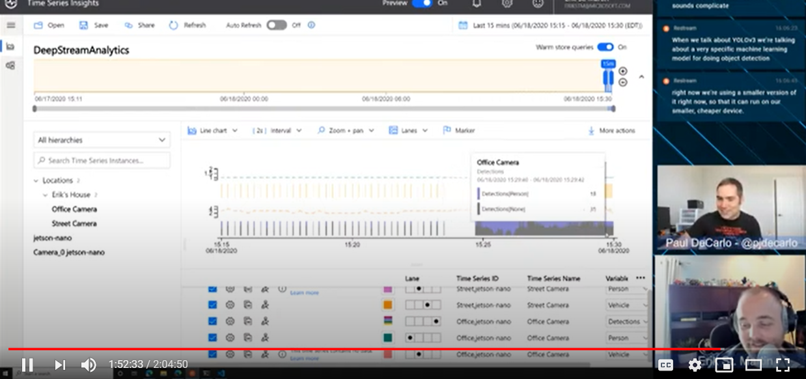](https://www.youtube.com/watch?v=l5tjaD-qYwY)

## Module 4.1 : Recreating the Azure Stream Analytics job in Microsoft Azure

Up to this point, our [deployment template references an Azure Stream Analytics job](https://github.com/toolboc/Intelligent-Video-Analytics-with-NVIDIA-Jetson-and-Microsoft-Azure/blob/master/deployment-iothub/deployment.template.json#L240) that exists in a foreign Azure subscription.  These steps will walk through recreating that job under our own Azure Subscription and provide an in-depth explanation of the functionality that it provides to our solution.  This should provide you with enough knowledge to begin customizing the supplied Stream Analytics Query to your preference.  We will then demonstrate how to update our current configuration to reference the newly created Azure Stream Analytics job.

Navigate to the Azure Marketplace and search for 'Azure Stream Analytics on IoT Edge' 

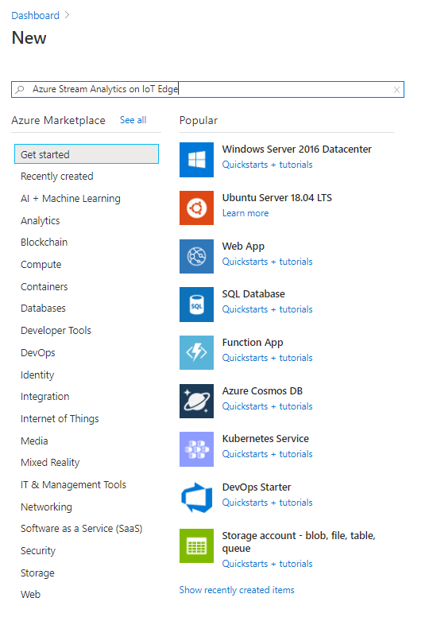

Select "Create":

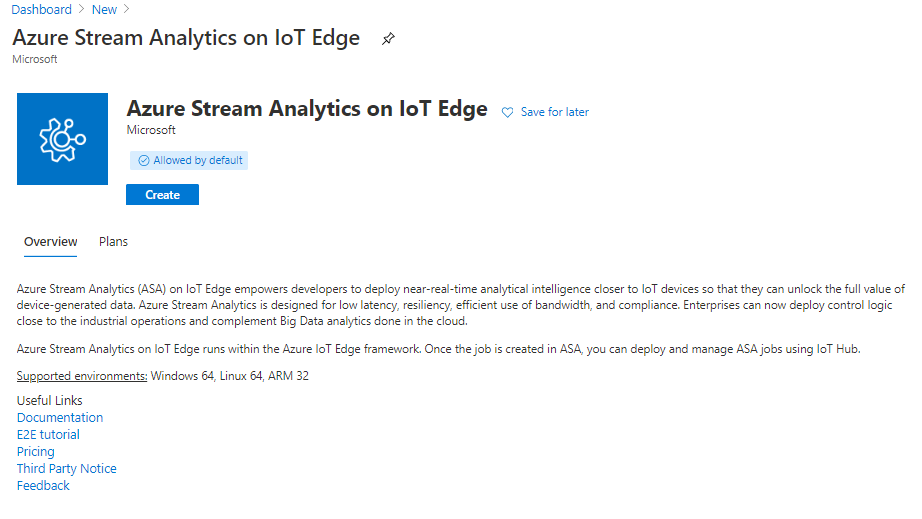


Name the Stream Analytics Job, ensure that it is deployed into the same region as the original IoT Hub,  ensure Hosting environment is set to "Edge", and ensure that the box labeled "Secure all private data assets needed by this job in my Storage account" is unchecked, then select "Create":


Navigate to the newly created job and select "Inputs", here will configure the input alias used in the [deployment template route configuration](https://github.com/toolboc/Intelligent-Video-Analytics-with-NVIDIA-Jetson-and-Microsoft-Azure/blob/master/deployment-iothub/deployment.template.json#L210).  This setting is important as it configures the NVIDIADeepStreamSDK output to flow into the DeepStreamAnalytics module as an input.  Naming is extremely important in this step and must match the alias used in the route configuration.  

Select, "Add stream input" and name the "Input Alias" to "DeepStreamInput" as shown:


Next, navigate to "Output", where where we will will configure the output alias used in the [deployment template route configuration](https://github.com/toolboc/Intelligent-Video-Analytics-with-NVIDIA-Jetson-and-Microsoft-Azure/blob/master/deployment-iothub/deployment.template.json#L211).  This setting is important as it configures the DeepStreamAnalytics Streaming Analytics job output to flow to our IoT Hub.  Naming is extremely important in this step and must match the alias used in the route configuration.  

Select, "Add" then "Edge Hub" as shown below:


In the resulting window, name the `Output Alias` "AggregatedDetections" and select "Save".

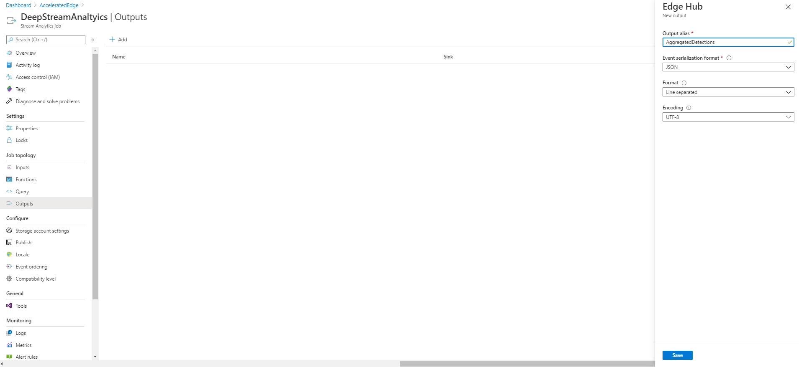

Select, "Add" then "Edge Hub" again, as shown below:


In the resulting window, name the `Output Alias` "SummarizedDetections" and select "Save".


You should now have two outputs defined, one for "AggregatedDetections" and another for "SummarizedDetections".

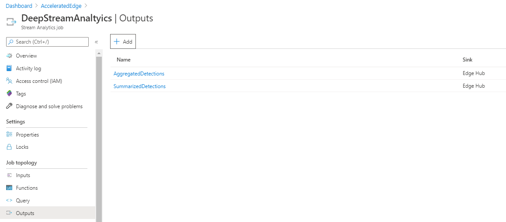

Navigate back to the newly created job and select "Query", then edit the Query to contain the contents of [DeepStreamAnalytics.sql](../services/AZURE_STREAMING_ANALYTICS/Edge/DeepStreamAnalytics.sql) and save the Query:

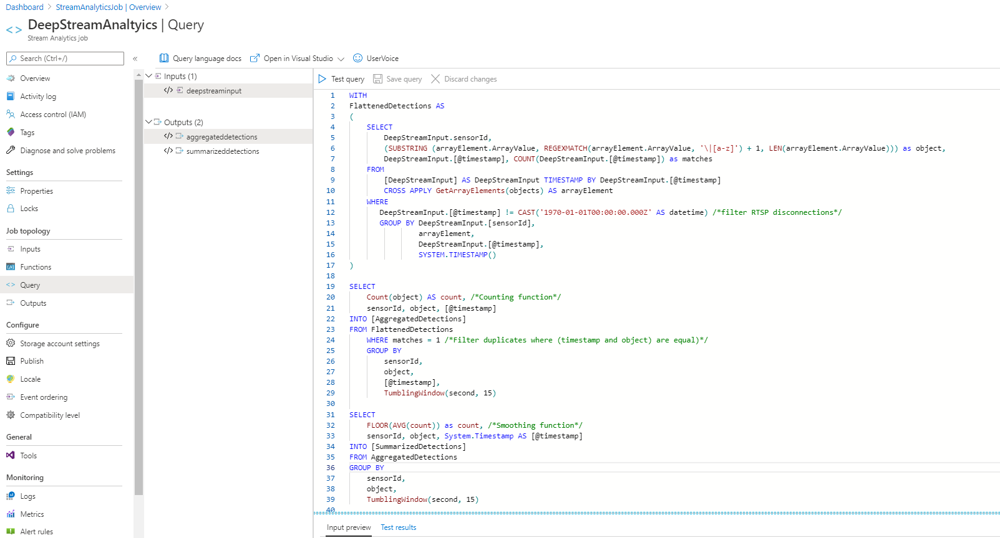

Next, select "Upload sample input" then upload the contents of [SampleInput.json](../services/AZURE_STREAMING_ANALYTICS/Edge/SampleInput.json).

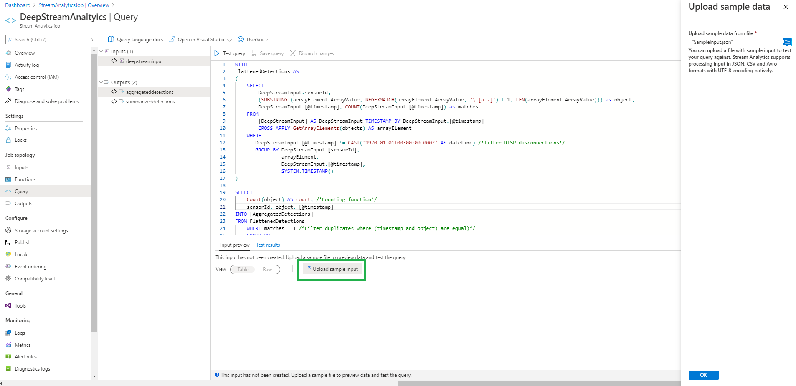

Select "OK", then "Test query" to produce the following result (You may also repeat the last step using [DemoData.json](../services/AZURE_STREAMING_ANALYTICS/Edge/DemoData.json) which contains sample data from an actual test run):

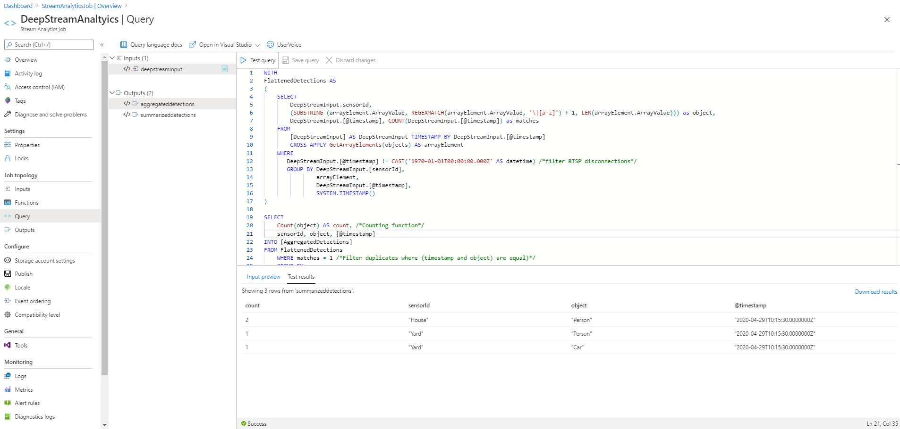

## Module 4.2 : A Brief Overview of the DeepStreamAnalytics SQL Query 

Azure Stream Analytics offers a SQL query language for performing transformations and computations over streams of events.  The [Stream Analytics Query Language Reference](https://docs.microsoft.com/en-us/stream-analytics-query/stream-analytics-query-language-reference?WT.mc_id=julyot-iva-pdecarlo) provides detailed information of the available syntax.

The DeepStreamAnalytics query works by first flattening the DeepStream message output by taking advantage of the [`REGEXMATCH`](https://docs.microsoft.com/en-us/stream-analytics-query/regexmatch-azure-stream-analytics?WT.mc_id=julyot-iva-pdecarlo) function.

Given the following example output from DeepStream where `objects` is formatted as [ *trackingId | bboxleft | bboxtop | bboxwidth | bboxheight | object* ]:

```
     {
      "version" : "4.0",
      "id" : 4348,
      "@timestamp" : "2020-04-29T10:15:22.439Z",
      "sensorId" : "Yard",
      "objects" : [
        "1|409|351|544|465|Car",
        "2|410|351|543|465|Car",
        "3|480|351|543|465|Person"
      ]
    }
```

The first query will transform this output into the following format, which is referenced as `FlattenedDetections`:

| sensorId | object | @timestamp               | matches |
|----------|--------|--------------------------|---------|
| Yard     | Car    | 2020-04-29T10:15:22.439Z | 1       |
| Yard     | Car    | 2020-04-29T10:15:22.439Z | 1       |
| Yard     | Person | 2020-04-29T10:15:22.439Z | 1       |

The next step filters out any duplicates using the `matches` value , i.e. rows where (timestamp and objects) were equal in the original data, then aggregates the results to produce a count of how many objects were present in each DeepStream message over a 15 second interval.  This table is aliased as `AggregatedDetections`.

|count  | sensorId | object | @timestamp               |
|-------|----------|--------|--------------------------|
| 2     | Yard     | Car    | 2020-04-29T10:15:22.439Z |
| 1     | Yard     | Person | 2020-04-29T10:15:22.439Z |

Finally, a smoothing function floors the average of `count` over the same 15 second interval into a table aliased as `SummarizedDetections`.  Our example message produces the same result as the previous query, but it should be clear that if a decimal is encountered in the average that it would be rounded down to the nearest whole number.

Using this information, you should be able to modify the query to produce results over a longer or shorter time window and/or report the `true` average instead of rounding down in the smoothing function. 

## Module 4.3 : Publishing the DeepStream Analytics Job 

Azure Stream Analytics on Edge uses Azure Storage to host the DeepStream Analytics job by packing the query into a publicly accessible zip file.  This is why we are able to reference a job that exists in another subscription.  For example, [the job specified in the default deployment template](https://github.com/toolboc/Intelligent-Video-Analytics-with-NVIDIA-Jetson-and-Microsoft-Azure/blob/master/deployment-iothub/deployment.template.json#L240).

To publish the new job into our own subscription, we will navigate back to the newly created Azure Stream Analytics on Edge job and select "Storage Account Settings" => "Add Storage Account".  Here you can select the existing [storage account that we setup for the CameraTaggingModule](https://github.com/toolboc/Intelligent-Video-Analytics-with-NVIDIA-Jetson-and-Microsoft-Azure/blob/master/docs/Module%202%20-%20Configure%20and%20Deploy%20Intelligent%20Video%20Analytics%20to%20IoT%20Edge%20Runtime%20on%20NVIDIA%20Jetson.md#module-24--configure-the-blob-storage-module-dependencies) and then create a new container to host the job, OR, you could create a whole new storage account by repeating [the relevant instructions in Module 2.4](https://github.com/toolboc/Intelligent-Video-Analytics-with-NVIDIA-Jetson-and-Microsoft-Azure/blob/master/docs/Module%202%20-%20Configure%20and%20Deploy%20Intelligent%20Video%20Analytics%20to%20IoT%20Edge%20Runtime%20on%20NVIDIA%20Jetson.md#module-24--configure-the-blob-storage-module-dependencies) and configure it appropriately.  

It is up to you whether you wish to use a single storage account for both the CameraTaggingModule and Azure Stream Analytics on Edge job OR whether you want to use separate storage accounts to service them respectively.  

Once you have configured the storage account appropriately, select "Save".


 Next, we will navigate back to the newly created Azure Stream Analytics on Edge job and select "Publish" => "Publish".  A prompt will appear, select "Yes" to proceed.  This will generate a SAS URL as shown below.  In the next step, we will reference this SAS URL in our deployment template to update the currently deployed job to the new one.

 

## Module 4.4 : Deploying the DeepStream Analytics Job 

 On your development machine, open Visual Studio Code and open the folder of the repository that we cloned to the dev machine during Module 2.  We need to re-configure our deployment to reference the newly published DeepStream Analytics job.  Up to this point, the deployment template has referenced an DeepStream Analytics that lives in a foreign Azure subscription.  

To begin, open `deployment-iothub/deployment.template.json` and delete the following highlighted section:

 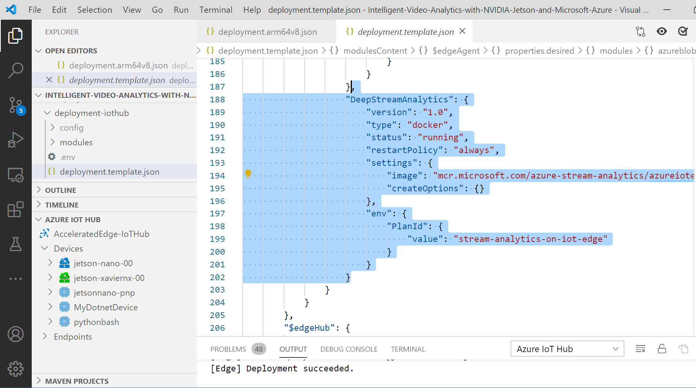

This will delete the DeepStreamAnalytics module entry from our deployment template and allow us the ability to re-create it.  

Next, bring up the command pallette with (CTRL+SHIFT+P) and type in "Azure IoT Edge: Add IoT Edge Module" to launch that task.  When prompted to "Select Deployment Template File", select the `deployment-iothub/deployment.template.json` option:

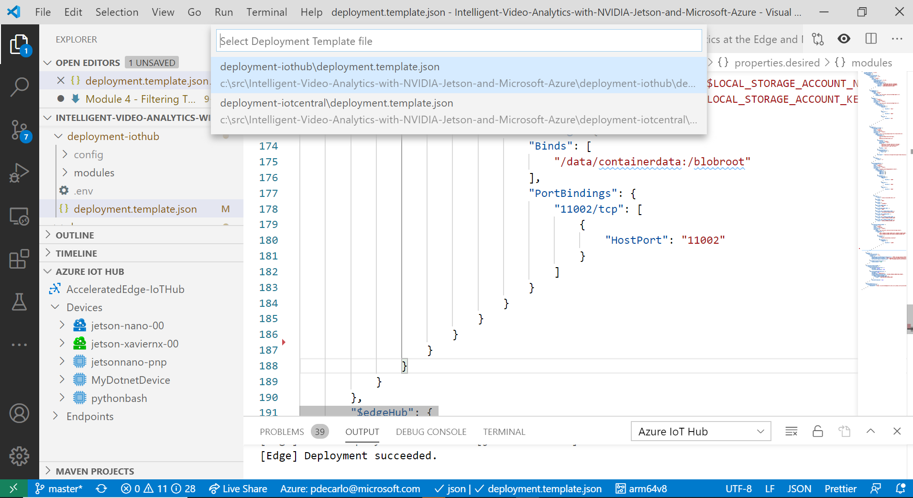

Next, select the "Azure Stream Analytics" module template:

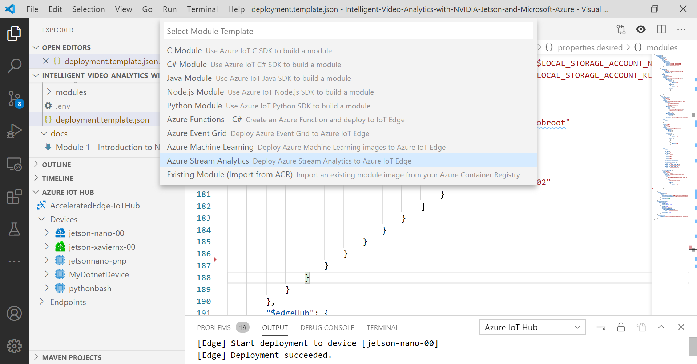

Next, name the module "DeepStreamAnalytics", this name is very important and will be referenced later, ensure that it is named exactly as shown:

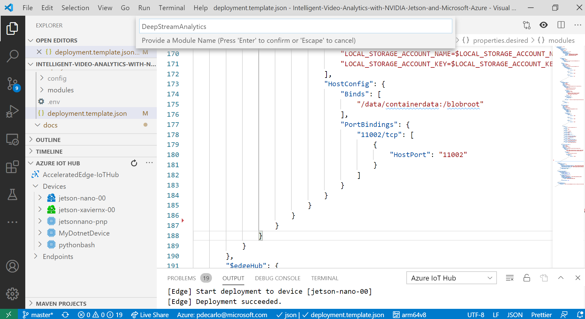

Next, you will need to select your newly published Azure Stream Analytics job:

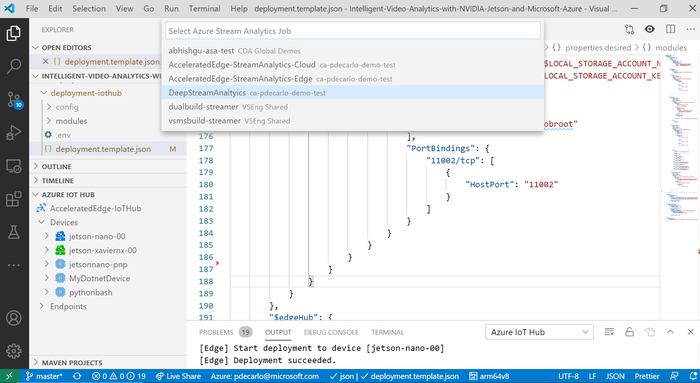

Once these options are completed, the deployment.template.json will re-apply the DeepStreamAnalytics module to pull the SAS job from your newly deployed Azure Stream Analytics on Edge job.  We still new to make a few additional changes that the tooling does not account for.  

First, we need to update to pull an ARM compatible image that is capable of running on the Jetson device.  Modify the image entry for the DeepStreamAnalytics module to reference the following image and tag `mcr.microsoft.com/azure-stream-analytics/azureiotedge:1.0.6-linux-arm32v7` as shown:

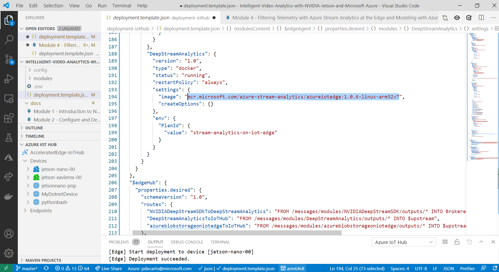

Next, we need to update the route to only send "SummarizedDetections". By default the tooling will configure all output to flow to IoTHub ("AggregatedDetections" and "SummarizedDetections"), modify the route entry for `DeepStreamAnalyticsToIoTHub` to `"FROM /messages/modules/DeepStreamAnalytics/outputs/SummarizedDetections INTO $upstream",` as shown:

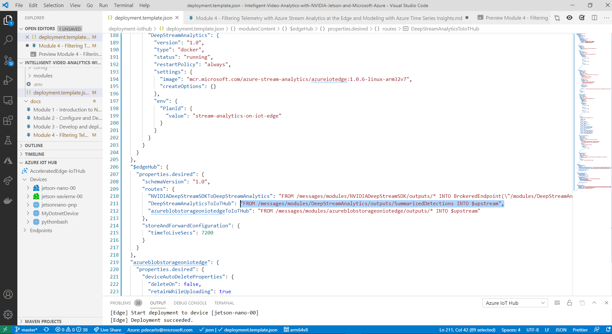

You can validate the changes are correct by looking at the diff of changes to `deployment-iothub/deployment.template.json`, there will be number of entries added to `DeepStream Analytics: { "properties.desired": {` and it should be the only section in that file that shows any modifications.

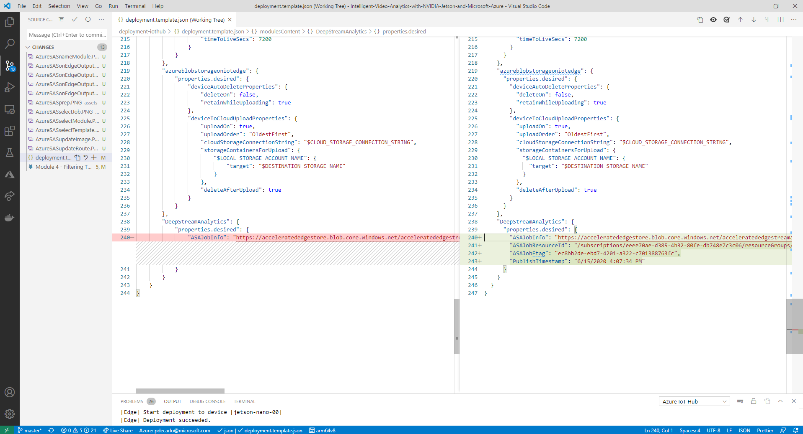

Let's quickly overview what the entries are and how they are used by the Stream Analytics on Edge Job:

* **ASAJobInfo** [required] is a SASURL pointing to a zip package in blob storage, this zip package contains the compiled ASA job including the dlls, job configuration, definition, and customer code (if you have it defined). The ASA module will download this package and start the job from it. This is the only property the module actually needs to start a streaming job.
* **ASAJobResourceId** [optional] is the resource id of the ASA job you choose to deploy. This property is used by the module to call back to ASA service to check whether there is a job update or not after the initial deployment.
* **ASAJobEtag** [optional] is the hash id of the currently deployed job. This is used also by the module to check whether there is a job update or not after the initial deployment.
* **PublishTimestamp** [optional] is the job publish time, which is just to show when the streaming job was compiled and published to blob storage. 

With these entries, it is now possible to sync changes between your published Stream Analytics Job and the DeepStreamAnalytics module running on the Edge.

After you have made the modifications and saved the now-updated `deployment-iothub/deployment.template.json`, expand the `deployment-iothub` folder and right-click the `deployment.template.json` file, then select "Generate IoT Edge Deployment Manifest".  This will produce a new folder in that directory named "config" and an associated deployment named `deployment.arm64v8.json`.  Right-click the `deployment.arm64v8.json` file and select "Create Deployment for Single Device".

A drop-down should appear showing all devices registered in your currently selected IoT Hub. Choose the device that represents your Jetson Device and the deployment will begin to activate on your device (provided the IoT Edge runtime is active and that the device is connected to the internet).

## Module 4.5 : Configure and deploy Azure Time Series Insights with an IoT Hub event source 

[Azure Time Series Insights](https://docs.microsoft.com/en-us/azure/time-series-insights/?WT.mc_id=julyot-iva-pdecarlo) allows us to contextually visualize data coming in from our IoT devices to identify and produce actionable insights.  It supports "cold" archival analysis and near real-tim "warm" query features. It is also possible to integrate Time Series Insights with advanced analytics services, such as [Azure Machine Learning](https://docs.microsoft.com/en-us/azure/machine-learning/?WT.mc_id=julyot-iva-pdecarlo), [Azure Databricks](https://docs.microsoft.com/en-us/azure/azure-databricks/?WT.mc_id=julyot-iva-pdecarlo), [Apache Spark](https://docs.microsoft.com/en-us/azure/hdinsight/spark/apache-spark-overview?WT.mc_id=julyot-iva-pdecarlo), and others. 

In this section, we will configure and deploy a Time Series Insights instance in order to visualize and operate on object detection data produced by our Jetson device(s).  We will demonstrate creating a "Pay-As-You-Go" deployment to minimize costs, additional details on available pricing options for Time Series Insights can be found [here](https://azure.microsoft.com/en-us/pricing/details/time-series-insights/?WT.mc_id=julyot-iva-pdecarlo).

To get started, navigate to the Azure Marketplace and search for 'Time Series Insights' 

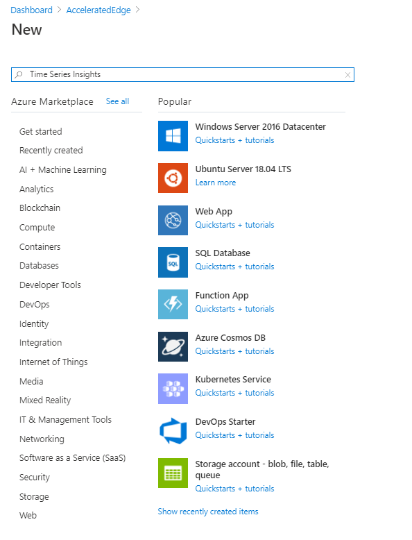

Select "Create":

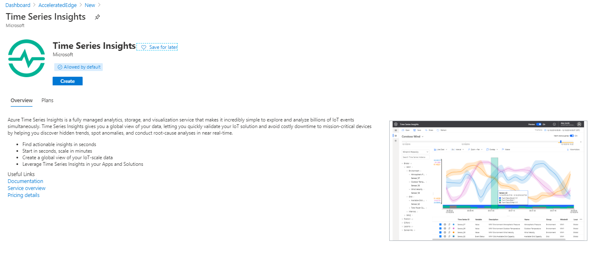

In the "Review + Create" section, ensure that you are deploying into the same reason that contains your IoT Hub.  Ensure that "PAYG" tier is selected.  This will create a drop-down underneath for configuring the "Time Series Id".  Selecting an appropriate Time Series ID is critical. Choosing a Time Series ID is like choosing a partition key for a database. It is required when you create a Time Series Insights Preview environment and it cannot be re-configured once set.  We will configure this section to use the `sensorId` and `iothub-connection-device-id`, allowing us to partition our data in an organized fashion.  This is possible because our Stream Analytics job produces a `sensorId` value in it's output.  The `iothub-connection-device-id` is supplied by the IoT Edge runtime and corresponds to the device which produced the message to IoT Hub.  Ensure that you have configured the options similar to the image below:

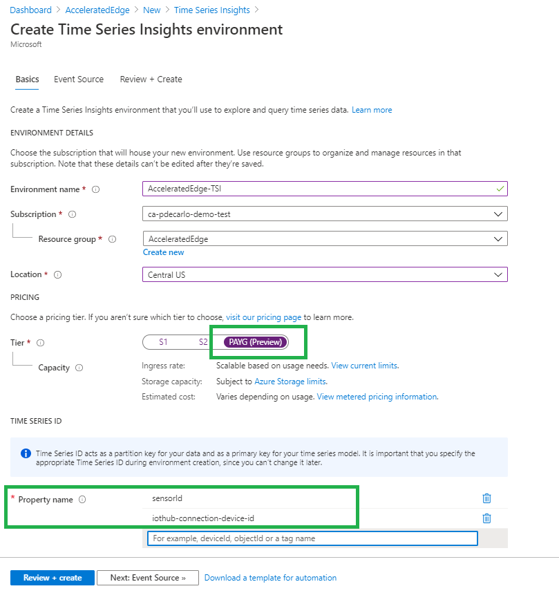

As you scroll down a bit further, there is a section for configuring the "Cold" and "Warm" store options.  You must create a new storage account to act as the "Cold" storage but can optionally decide on whether to use "Warm" store features.  The image below shows both of these options configured:

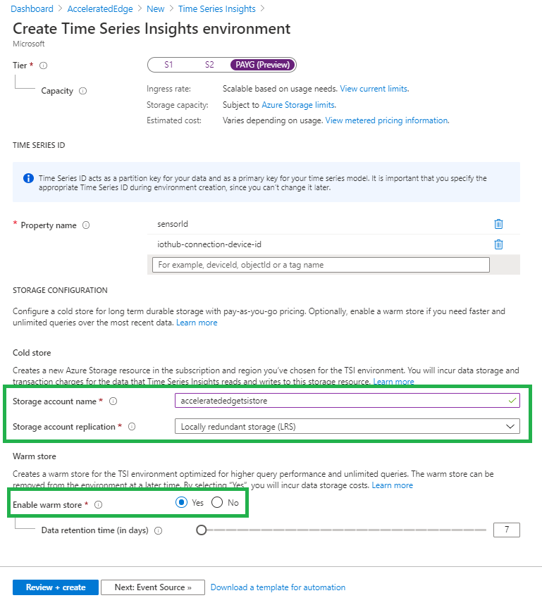

Next, select "Next: Event Source" to configure the Event Source that will provide data to the TSI instance.  Provide a name for the Event Source then select your existing IoT Hub.  For the `IoT Hub access policy name` choose the `iothubowner` policy, for more details on the available policies check out the [available documentation](https://docs.microsoft.com/en-us/azure/iot-hub/iot-hub-devguide-security?WT.mc_id=julyot-iva-pdecarlo).  In the "Consumer Group" area, in the section for configuring `IoT Hub consumer group`, select "Add" and create a new consumer group named "tsi" as shown.  See this [article](https://docs.microsoft.com/en-us/azure/iot-hub/iot-hub-devguide-messages-read-builtin?WT.mc_id=julyot-iva-pdecarlo) for more information on consumer groups.  Finally, in the "TIMESTAMP" are, set the value of "Property name" to `@timestamp` which corresponds to the timestamp field in our DeepStreamAnalytics query output. 


On the next screen, select "Create" to begin deployment of the TSI instance.  
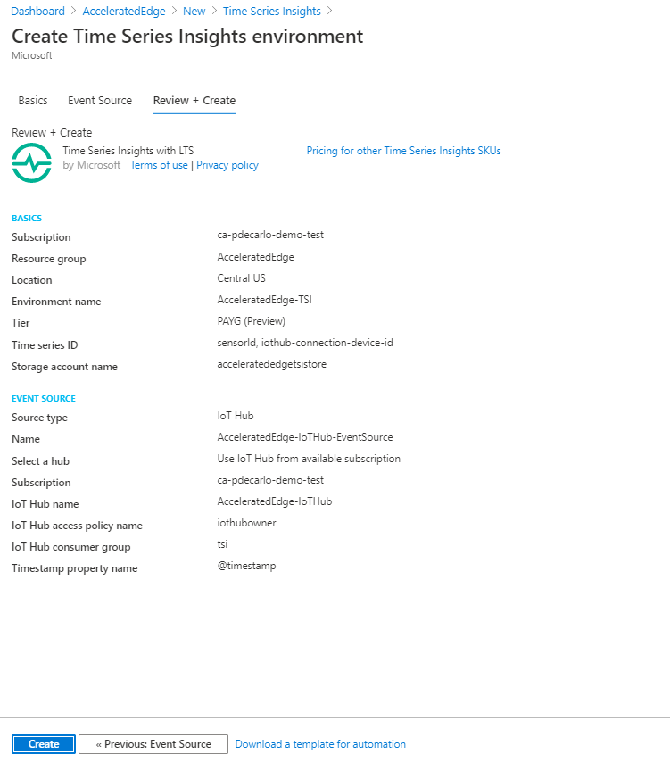

Once the deployment has completed, navigate to the TSI instance and click the link next to "Time Series Insights explorer URL":

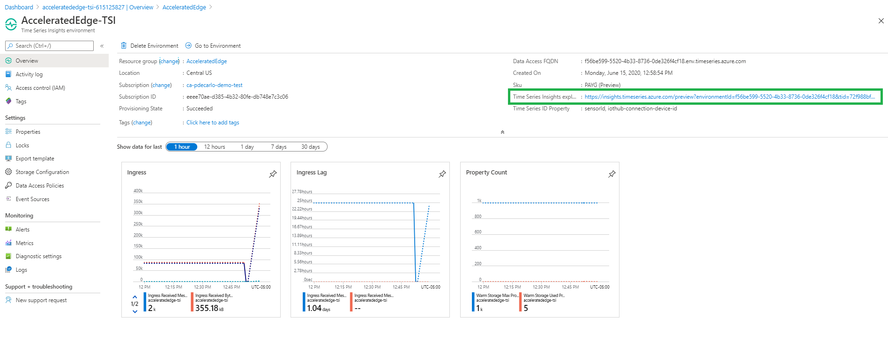

This will bring you to the "Time Series Insights Explorer", by default you should see all devices that are currently producing data into the assigned event source, denoted by `sensorId` `iothub-connection-device-id`.

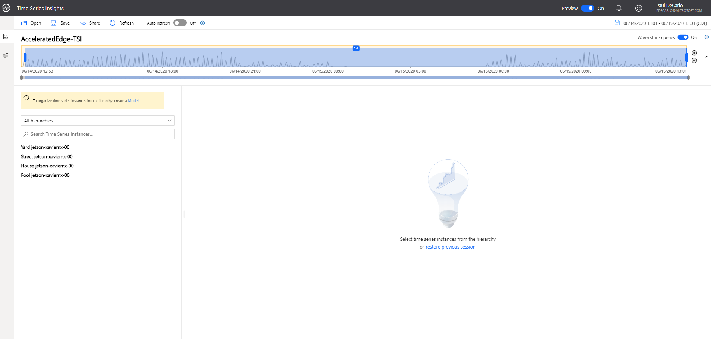

Select "Model" on the left-hand side and we will begin to configure the data model and hierarchy for our instances.


First, we will select "Types", then "Upload JSON".  When prompted, upload the [`ObjectDetectionType.json`](../services/TIME_SERIES_INSIGHTS/Types/ObjectDetectionType.json) file located in `../services/TIME_SERIES_INSIGHTS/Types`, then select "Upload".

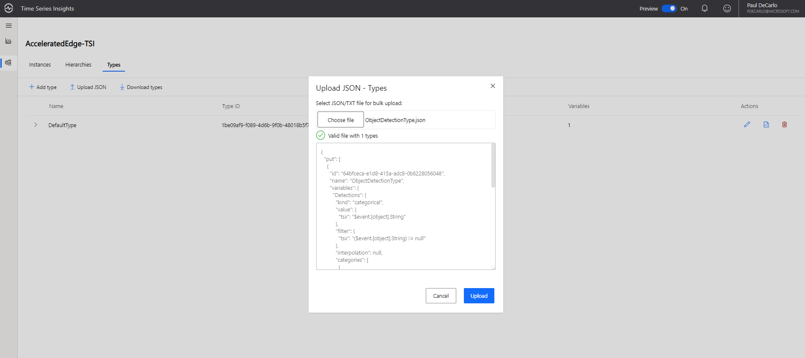

Perusing this ObjectDetectionType defintion, you will notice capabilities for reporting "Detections", "Person", and "Vehicle".  Take note of the query syntax used in these examples and modify to meet your requirements.  This will allow us to model data which meets the query criteria in the TSI explorer dashboard.

Next, select "Hierarchies", then "Upload JSON".  When prompted, upload the [`Locations.json`](../services/TIME_SERIES_INSIGHTS/Hierarchies/Locations.json) file located in `../services/TIME_SERIES_INSIGHTS/Hierarchies`, then select "Upload". 

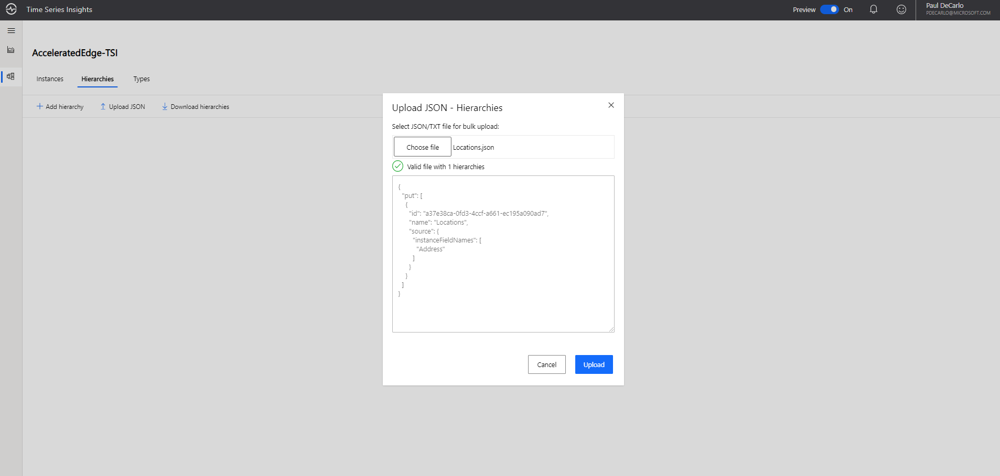

This definition will allow us to organize our devices by location when displayed in the TSI dashboard.

Next, select "Instances" and for each device, select "Edit", set "Type" to "ObjectDetectionType", then rename your device to something preferable.

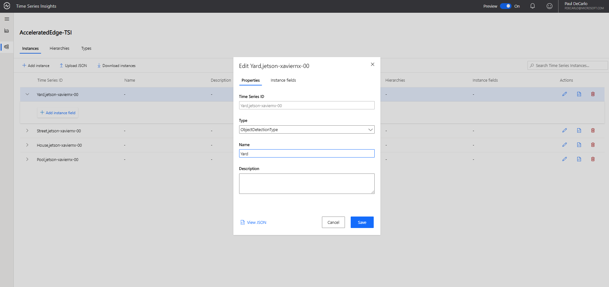

Next, select "Instances" and again, for each device, select "Edit", then select "Instance fields" and enter a value for "Address".  This will allow us to organize devices by their address value in the TSI dashboard.


Once you have completed this for all devices, you should have a result similar to the following:


Next, select "Analyze" and head back to the TSI Explorer dashboard.  You can now expand the "Locations" entry, select the value of the location of interest and begin plotting detections, person, or vehicle data from that device.


## Module 4.6 : Next Steps

Now that you are familiar with the relationship between the filtered data being produced by the DeepStreamAnalytics Azure Stream Analytics Job and the modeled data in Time Series Insights, it is possible to customize your solution further to fit your use case.  

It is highly recommended to familiarize further with the features and functionalities available by checking out the following resources.

[Azure Time Sereies Insights Documentation](https://docs.microsoft.com/en-us/azure/time-series-insights/time-series-insights-overview?WT.mc_id=julyot-iva-pdecarlo)

[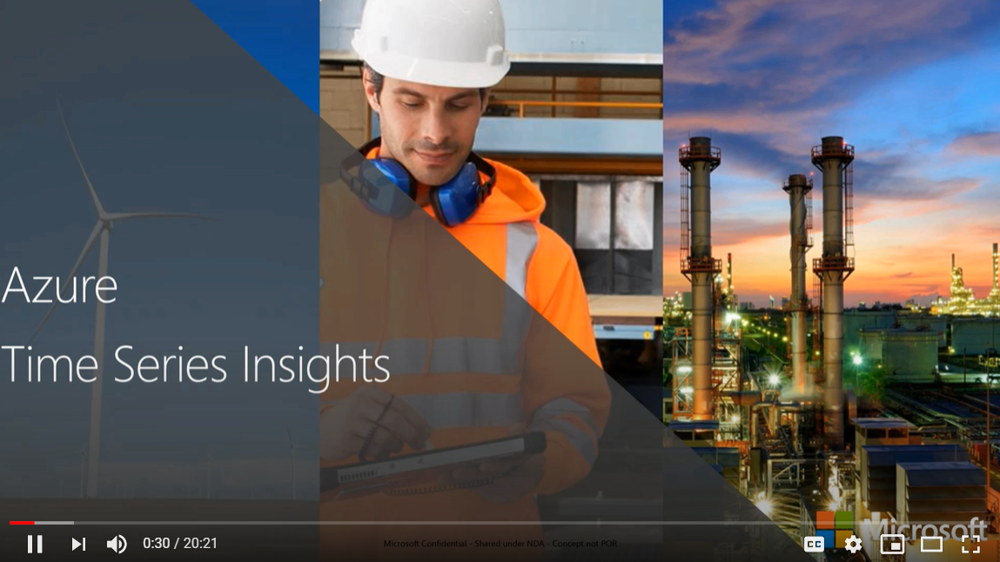](https://www.youtube.com/watch?v=GaARrFfjoss)