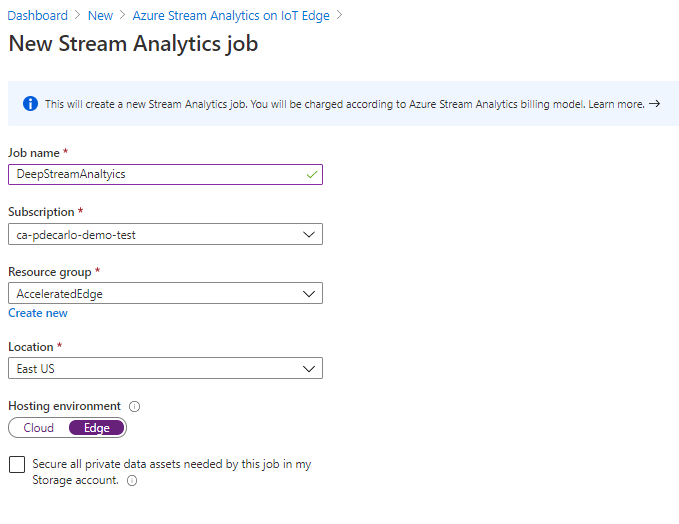
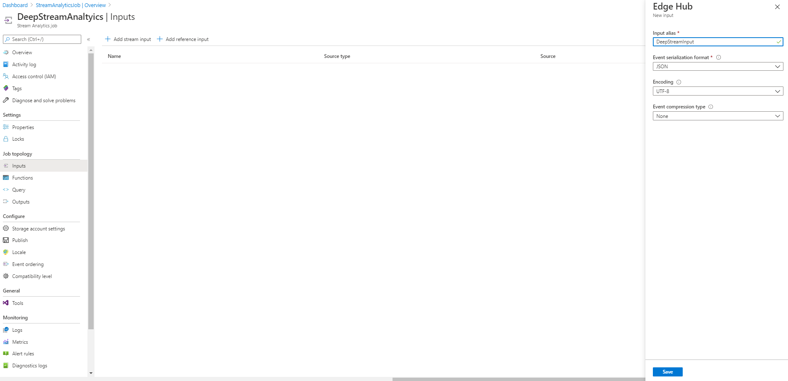
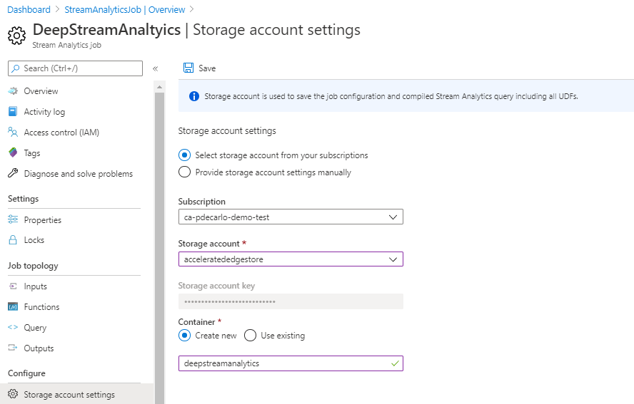
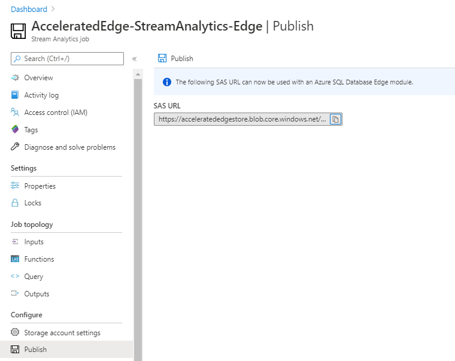

## Module 4 : Filtering Telemetry with Azure Stream Analytics at the Edge and Modeling with Azure Time Series Insights

At this point, you should have a working DeepStream Configuration referenced by the NVIDIADeepStreamSDK module, [customized to accommodate your video input source(s)](https://github.com/toolboc/Intelligent-Video-Analytics-with-NVIDIA-Jetson-and-Microsoft-Azure/blob/master/docs/Module%202%20-%20Configure%20and%20Deploy%20Intelligent%20Video%20Analytics%20to%20IoT%20Edge%20Runtime%20on%20NVIDIA%20Jetson.md#module-26--customizing-the-sample-deployment), and [configured to use a custom object detection model](./Module%203%20-%20Develop%20and%20deploy%20Custom%20Object%20Detection%20Models%20with%20IoT%20Edge%20DeepSteam%20SDK%20Module.md).

In this module we will explain how to flatten, aggregate, and summarize DeepStream object detection results using [Azure Stream Analytics on Edge](https://docs.microsoft.com/en-us/azure/stream-analytics/stream-analytics-edge?WT.mc_id=julyot-iva-pdecarlo) and forward that telemetry to our [Azure IoT Hub](https://docs.microsoft.com/en-us/azure/iot-hub/?WT.mc_id=julyot-iva-pdecarlo). We will then introduce a new Azure Service known as [Time Series Insights](https://docs.microsoft.com/en-us/azure/time-series-insights/?WT.mc_id=julyot-iva-pdecarlo).This service will take in input via an event-source from our IoT Hub to allow us to analyze, query, and detect anomalies within the object detection data produced by our IoT Edge device. 

## Module 4.1 : Recreating the Azure Stream Analytics job in Microsoft Azure

Up to this point, our [deployment template references an Azure Stream Analytics job](https://github.com/toolboc/Intelligent-Video-Analytics-with-NVIDIA-Jetson-and-Microsoft-Azure/blob/master/deployment-iothub/deployment.template.json#L240) that exists in a foreign Azure subscription.  These steps will walk through recreating that job under our own Azure Subscription and provide an in-depth explanation of the functionality that it provides to our solution.  This should provide you with enough knowledge to begin customizing the supplied Stream Analytics Query to your preference.  We will then demonstrate how to update our current configuration to reference the newly created Azure Stream Analytics job.

Navigate to the Azure Marketplace and search for 'Azure Stream Analytics on IoT Edge' 


Select "Create":


Name the Stream Analytics Job, ensure that it is deployed into the same region as the original IoT Hub,  ensure Hosting environment is set to "Edge", and ensure that the box labeled "Secure all private data assets needed by this job in my Storage account" is unchecked, the select "Create":



Navigate to the newly created job and select "Inputs", here will configure the alias used in the [deployment template route configuration](https://github.com/toolboc/Intelligent-Video-Analytics-with-NVIDIA-Jetson-and-Microsoft-Azure/blob/master/deployment-iothub/deployment.template.json#L210).  This setting is important as it configures the NVIDIADeepStreamSDK output to flow into the DeepStreamAnalytics module as an input.  Naming is extremely important in this step and must match the alias used in the route configuration.  

Select, "Add stream input" and name the "Input Alias" to "DeepStreamInput" as shown:



Navigate back to the newly created job and select "Query", then edit the Query to contain the contents of [DeepStreamAnalytics.sql](../services/AZURE_STREAMING_ANALYTICS/Edge/DeepStreamAnalytics.sql) and save the Query:


Next, select "Upload sample input" then upload the contents of [SampleInput.json](../services/AZURE_STREAMING_ANALYTICS/Edge/SampleInput.json).


Select "OK", the "Test query" to produce the following result (You may also repeat the last step using [DemoData.json](../services/AZURE_STREAMING_ANALYTICS/Edge/DemoData.json) which contains sample data from an actual test run):


## Module 4.2 : A Brief Overview of the DeepStreamAnalytics SQL Query 

Azure Stream Analytics offers a SQL query language for performing transformations and computations over streams of events.  The [Stream Analytics Query Language Reference](https://docs.microsoft.com/en-us/stream-analytics-query/stream-analytics-query-language-reference?WT.mc_id=julyot-iva-pdecarlo) provides detailed information of the available syntax.

The DeepStreamAnalytics query works by first flattening the DeepStream message output by taking advantage of the [`REGEXMATCH`](https://docs.microsoft.com/en-us/stream-analytics-query/regexmatch-azure-stream-analytics?WT.mc_id=julyot-iva-pdecarlo) function.

Given the following example output from DeepStream:

```
     {
      "version" : "4.0",
      "id" : 4348,
      "@timestamp" : "2020-04-29T10:15:22.439Z",
      "sensorId" : "Yard",
      "objects" : [
        "290|409|351|544|465|Car",
        "390|410|351|543|465|Car",
        "390|410|351|543|465|Person"
      ]
    }
```

The first query will transform this output into the following format, which is referenced as `FlattenedDetections`:

| sensorId | object | @timestamp               | matches |
|----------|--------|--------------------------|---------|
| Yard     | Car    | 2020-04-29T10:15:22.439Z | 1       |
| Yard     | Car    | 2020-04-29T10:15:22.439Z | 1       |
| Yard     | Person | 2020-04-29T10:15:22.439Z | 1       |

The next step filters out any duplicates using the `matches` value , i.e. rows where (timestamp and objects) were equal in the original data, then aggregates the results to produce a count of how many objects were present in each DeepStream message over a 15 second interval.  This table is aliased as `AggregatedDetections`.

|count  | sensorId | object | @timestamp               |
|-------|----------|--------|--------------------------|
| 2     | Yard     | Car    | 2020-04-29T10:15:22.439Z |
| 1     | Yard     | Person | 2020-04-29T10:15:22.439Z |

Finally, a smoothing function floors the average of `count` over the same 15 second interval into a table aliased as `SummarizedDetections`.  Our example message produces the same result as the previous query, but it should be clear that if a decimal is encountered in the average that it would be rounded down to the nearest whole number.

Using this information, you should be able to modify the query to produce results over a longer or shorter time window and/or report the `true` average instead of rounding down in the smoothing function. 

## Module 4.3 : Publishing the DeepStream Analytics Job 

Azure Stream Analytics on Edge uses Azure Storage to host the DeepStream Analytics job by packing the query into a publicly accessible zip file.  This is why we are able to reference a job that exists in another subscription.  For example, [the job specified in the default deployment template](https://github.com/toolboc/Intelligent-Video-Analytics-with-NVIDIA-Jetson-and-Microsoft-Azure/blob/master/deployment-iothub/deployment.template.json#L240).

To publish the new job into our own subscription, we will navigate back to the newly created Azure Stream Analytics on Edge job and select "Storage Account Settings" => "Add Storage Account".  Here you can select the existing [storage account that we setup for the CameraTaggingModule](https://github.com/toolboc/Intelligent-Video-Analytics-with-NVIDIA-Jetson-and-Microsoft-Azure/blob/master/docs/Module%202%20-%20Configure%20and%20Deploy%20Intelligent%20Video%20Analytics%20to%20IoT%20Edge%20Runtime%20on%20NVIDIA%20Jetson.md#module-24--configure-the-blob-storage-module-dependencies) and then create a new container to host the job, OR, you could create a whole new storage account by repeating [the relevant instructions in Module 2.4](https://github.com/toolboc/Intelligent-Video-Analytics-with-NVIDIA-Jetson-and-Microsoft-Azure/blob/master/docs/Module%202%20-%20Configure%20and%20Deploy%20Intelligent%20Video%20Analytics%20to%20IoT%20Edge%20Runtime%20on%20NVIDIA%20Jetson.md#module-24--configure-the-blob-storage-module-dependencies) and configure it appropriately.  

It is up to you whether you wish to use a single storage account for both the CameraTaggingModule and Azure Stream Analytics on Edge job OR whether you want to use separate storage accounts to service them respectively.  

Once you have configured the storage account appropriately, select "Save".



 Next, we will navigate back to the newly created Azure Stream Analytics on Edge job and select "Publish" => "Publish".  A prompt will appear, select "Yes" to proceed.  This will generate a SAS URL as shown below.  Copy this value to your clipboard.

 

 On your development machine, open Visual Studio Code and open the folder of the repository that we cloned to the dev machine during Module 2.  With the SAS URL copied to your clipboard, open `deployment-iothub/deployment.json`, then replace the value of [ASAJobInfo](https://github.com/toolboc/Intelligent-Video-Analytics-with-NVIDIA-Jetson-and-Microsoft-Azure/blob/master/deployment-iothub/deployment.template.json#L240) with the copied SAS URL.  This will update the DeepStreamAnalytics module to pull the SAS job from your newly deployed Azure Stream Analytics on Edge job.

After you have made the modification and saved the now-updated `deployment-iothub/deployment.json`, expand the `deployment-iothub` folder and right-click the `deployment.template.json` file, then select "Generate IoT Edge Deployment Manifest".  This will produce a new folder in that directory named "config" and an associated deployment named `deployment.arm64v8.json`.  Right-click the `deployment.arm64v8.json` file and select "Create Deployment for Single Device".

A drop-down should appear showing all devices registered in your currently selected IoT Hub. Choose the device that represents your Jetson Device and the deployment will begin to activate on your device (provided the IoT Edge runtime is active and that the device is connected to the internet).

## Module 4.4 : Configure and deploy Azure Time Series Insights with an IoT Hub event source 