## Module 5 : Visualizing Object Detection Data in Near Real-Time with PowerBI

Power BI is a business analytics service provided by Microsoft. It provides interactive visualizations with self-service business intelligence capabilities, where end users can create reports and dashboards by themselves, without having to depend on information technology staff or database administrators.

In this module, we will cover how to forward object detection telemetry from our Azure IoT Hub into a PowerBI dataset using a cloud-based Azure Stream Analytics job.  This will allow us to build a report that can be refreshed to update as detections are produced.  We will then Publish a PowerBI report and convert it to a live dashboard.  From there, we can query our data with natural language and interact with our data in near real-time.

In order to complete this module, it will require that you have an active PowerBI account.  If you need to create one, this [video](https://channel9.msdn.com/Blogs/BretStateham/Signing-up-for-Power-BI) walks through the process.

## Module 5.1 : Forwarding telemetry from IoT Hub to PowerBI using a Cloud-Based Azure Stream Analytics Job

[Azure Stream Analytics enables you to take advantage of one of the leading business intelligence tools](https://docs.microsoft.com/en-us/azure/stream-analytics/stream-analytics-power-bi-dashboard?WT.mc_id=julyot-iva-pdecarlo), Microsoft [Power BI](https://docs.microsoft.com/en-us/power-bi/fundamentals/power-bi-overview?WT.mc_id=julyot-iva-pdecarlo). In this section, you will learn how to configure Power BI as an output from a Azure Stream Analytics job that forwards data arriving into our IoT Hub.

To begin, we will create a PowerBI workspace to publish our dataset and reports to. Navigate to powerbi.microsoft.com and log in.  Next, select the "Workspace" icon then "Create a workplace":

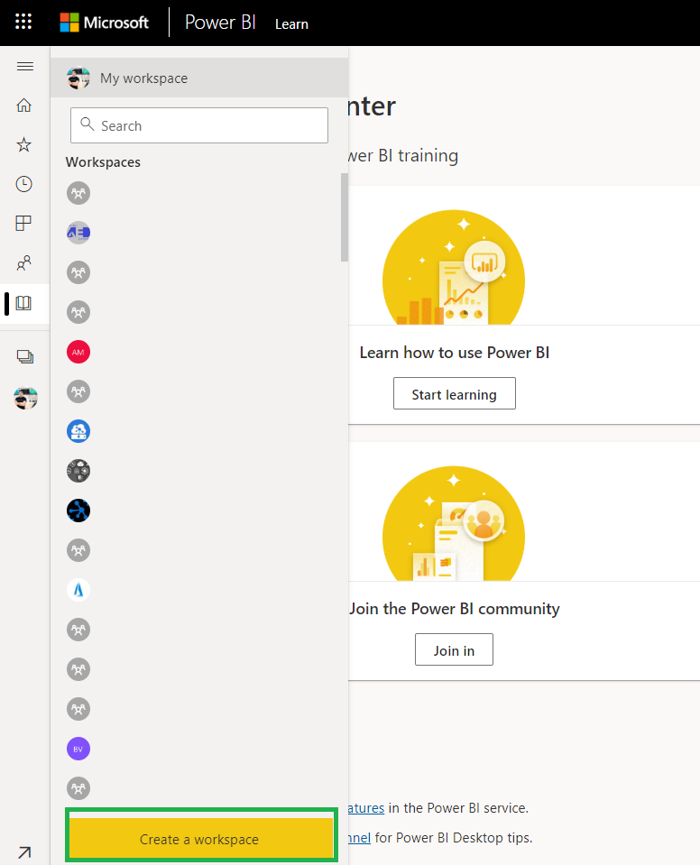

In the resulting prompt, name your workspace "Intelligent Video Analytics" and select "Save":

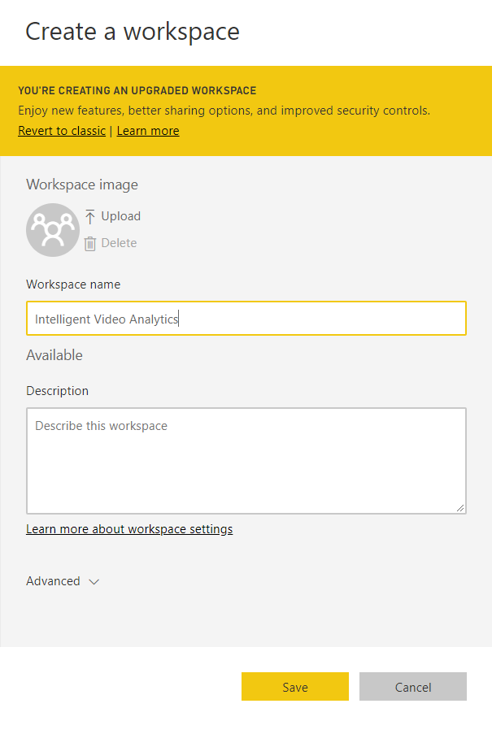

Next, we will create a new consumer group to allow access to messages produced by our IoT Hub.  IoT Hubs limit the number of readers within one consumer group (to 5) and this will ensure that any future modifications to the solution do not impact ability to process messages. To accomplish this, navigate to your IoT Hub instance and select "Built-in Endpoints" then create a new "Consumer Group" named "sas" as shown :

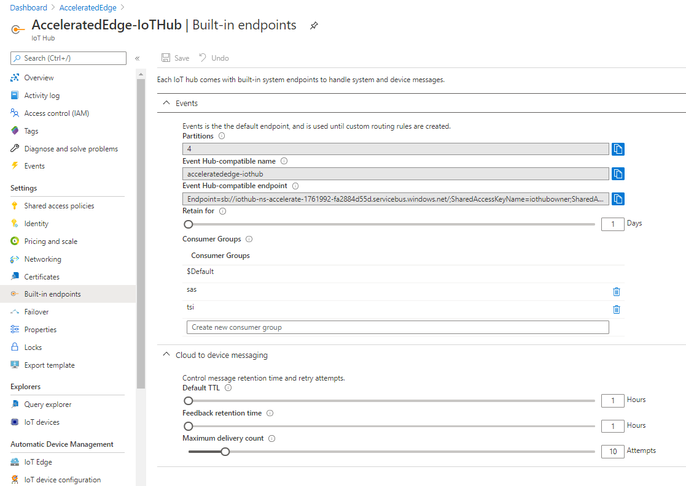

Navigate to the Azure Marketplace and search for 'Stream Analytics job' 

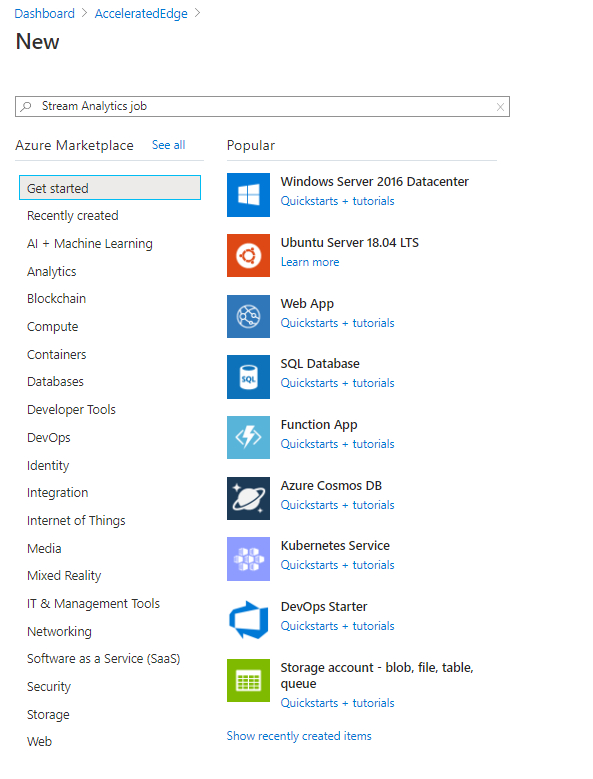

Select "Create":

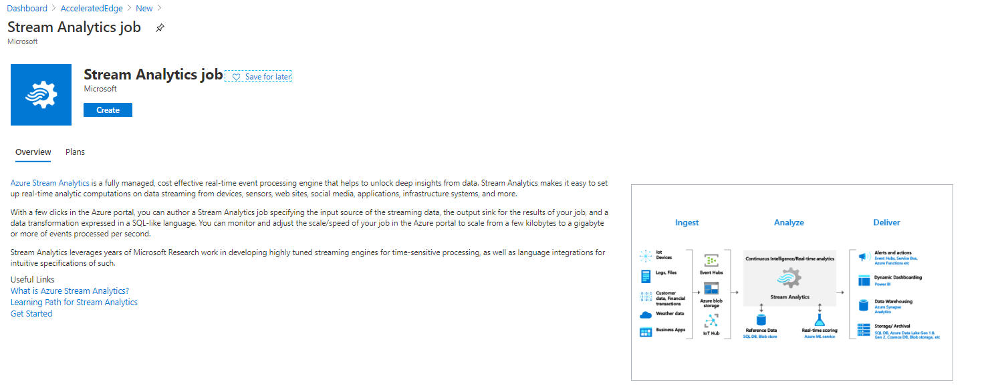

Name the Stream Analytics Job, ensure that it is deployed into the same region as the original IoT Hub, ensure Hosting environment is set to "Cloud", set the "Stream units" to "1", then select "Create":

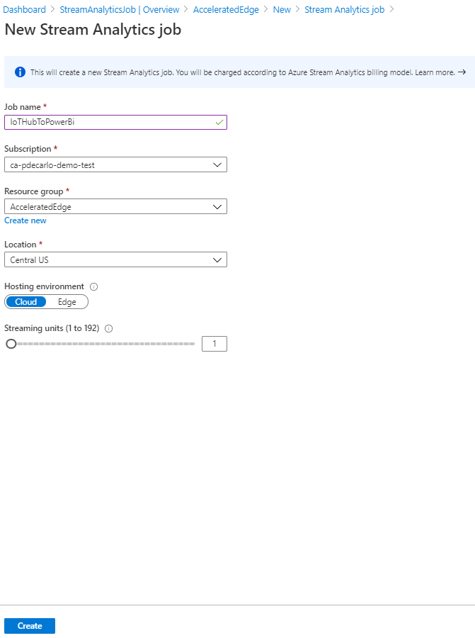

Navigate to the newly created job and select "Inputs", here will configure the input alias used in to forward data from out IoT Hub.  Naming is extremely important in this step and must match the alias used in the query.  

Select, "Add stream input", then in the resulting drop-down select "IoT Hub", then name the "Input Alias" to "IoTHub-Input" (naming is very important in this step!) and ensure that the Consumer groups is set to "sas" as shown:

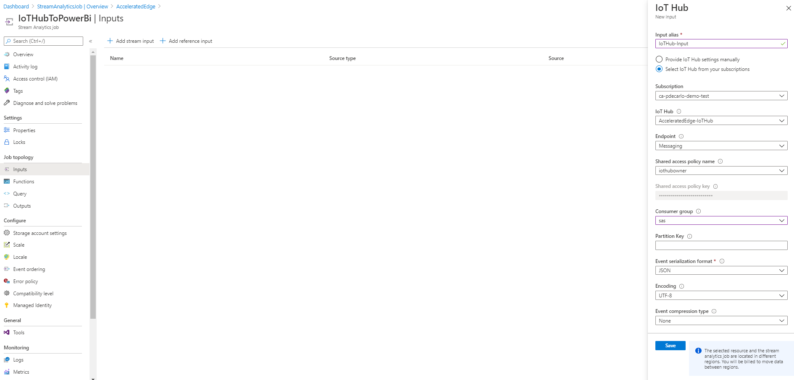

Next, navigate to "Output", where where we will will configure the output alias used to push data into a PowerBI sink.  Select "Add" then select "Power BI" and authorize the PowerBI service in the resulting prompt:  

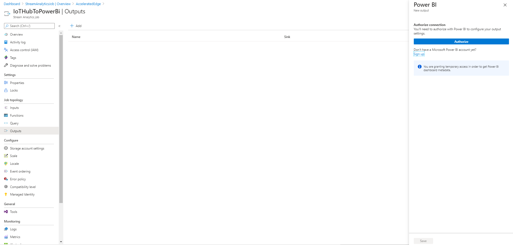 

In the resulting prompt, name the "Output Alias" to "StreamAnalytics-Cloud-Output" (naming is very important in this step!).  Set "Group Workspace" to the value used earlier when we created a new workspace at powerbi.microsoft.com ("Intelligent Video Analytics"),  set "Dataset name" to "Intelligent Video Analytics Dataset", and set "Table name" to "Intelligent Video Analytics Table".  Finally, set Authentication mode to "User Token":

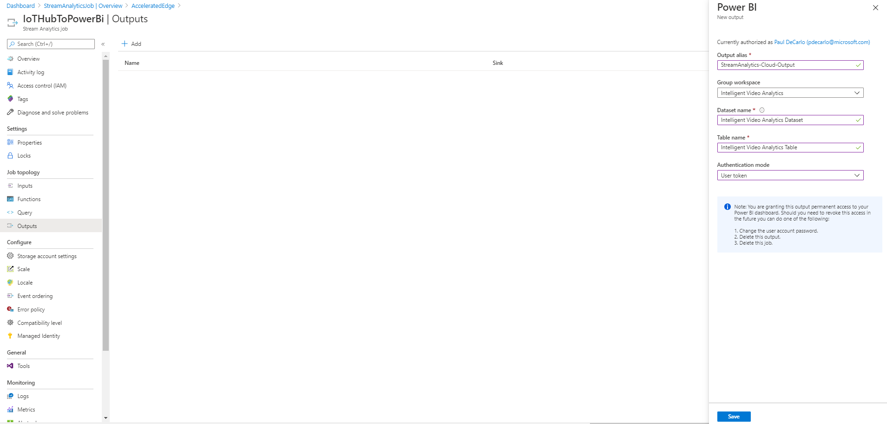

Navigate back to the newly created job and select "Query", then edit the Query to contain the contents of [IoTHubToPowerBI.sql](../services/AZURE_STREAMING_ANALYTICS/Cloud/IoTHubToPowerBI.sql) and save the Query:

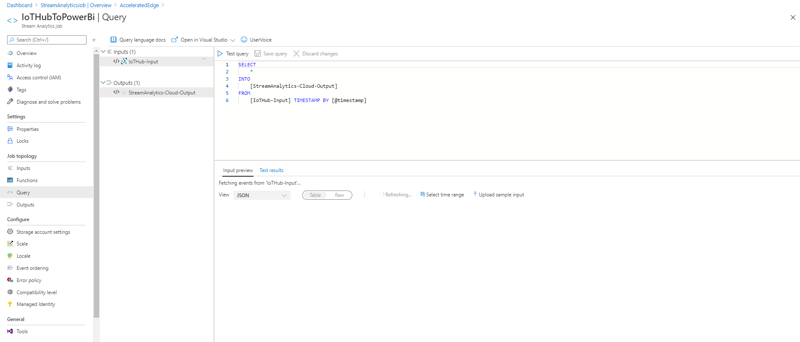

As long as data is flowing into your IoT Hub, you can select "Test query" and it should produce results.  If not, double-check that your Input and Output alias names match those specified in the query:


Next, navigate to the "Overview" section of the new Stream Analytics Job and select "Start" to begin running the job:


After a few minutes, you should see that a new DataSet has been created under your workspace at powerbi.microsoft.com:


## Module 5.2 : Import PowerBI Template and publish PowerBI Report 

For the next step, you will need to install the [Power BI Desktop application](https://powerbi.microsoft.com/en-us/desktop/) (requires a modern Windows OS).  We will use a pre-supplied template to rapidly produce a dashboard for viewing object detection telemetry.

To begin, open Power BI Desktop and select "File" => "Import" => "Power BI template":

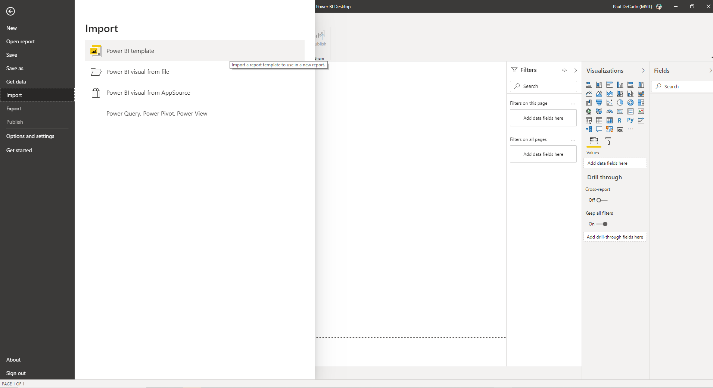

Next, navigate to the source folder of this repo and open the "services\POWER_BI\DeepStream+PowerBI.pbit" template file:


You may receive a message indicate that PowerBI is unable to connect to the Data Source, we can configure the template to attach to our newly published dataset by selecting "Transform data" => "Data Source Settings" then select the dataset published previously ("Intelligent Video Analytics Dataset").  If you followed the suggested naming convention in the previous module, the data should import and display without issue, otherwise you may need to reconfigure some of the parameters for the pre-supplied template:

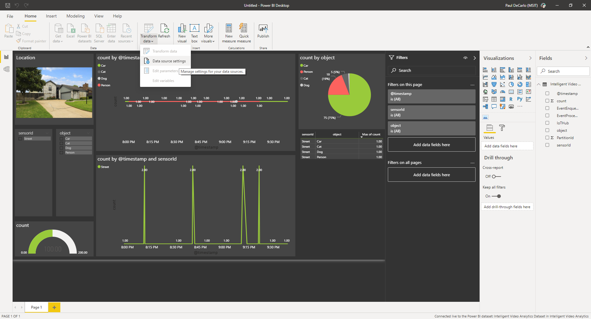

To publish the template, select "Publish", save and name the report "Intelligent Video Analytics Report", then publish the "Intelligent Video Analytics" workspace, you should receive a prompt indicating success, click the link to open your report in PowerBI online:


## Module 5.3 : Create a live PowerBI Dashboard in PowerBI Online 

You should now see a view of your published report in PowerBI online, select the "Pin Live" button to pin your report to a live dashboard.  Name the dashboard "Intelligent Video Analytics Dashboard" as shown:


Navigate to the "Intelligent Video Analytics" workspace and select Dashboard, you should see the newly pinned live dashboard, select it:
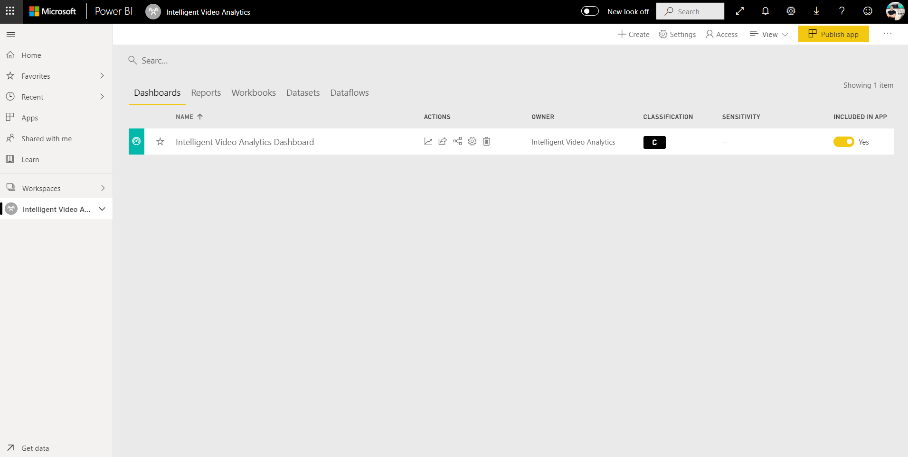

Notice that there is now a section to "Ask a question about your data":
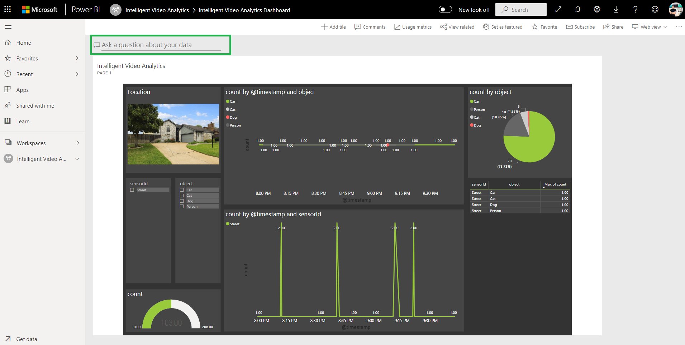

Try some of these examples:
```
Max of count person in last minute by sensor id
MAX of count car in yard in last minute  
AVG count of car in Street in last minute    
LAST person by sensorid
Pie Chart count of person by sensorid in last day (@timestamp)
```

For each example, feel free to modify the [object] value, once you have obtained a desirable result, you can pin the visual to your dashboard: 

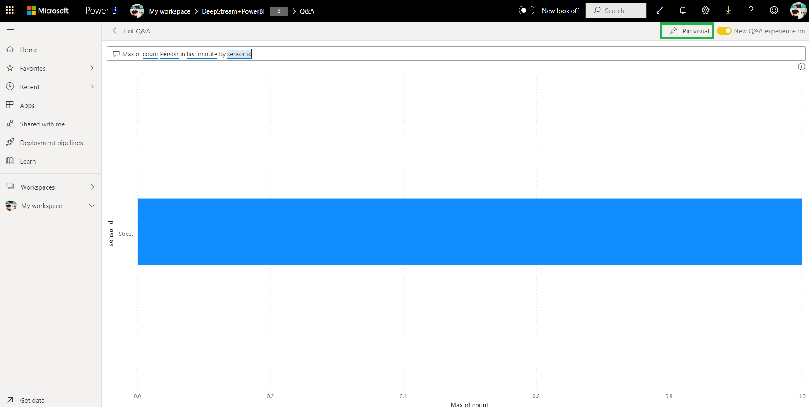

Repeat this process until you have a desirable result:


## Module 5.4 : Add a Streaming Data Tile to PowerBI Dashboard in PowerBI Online 

Next, we will add a Streaming data tile by selecting "Add tile" => "Custom Streaming Data":

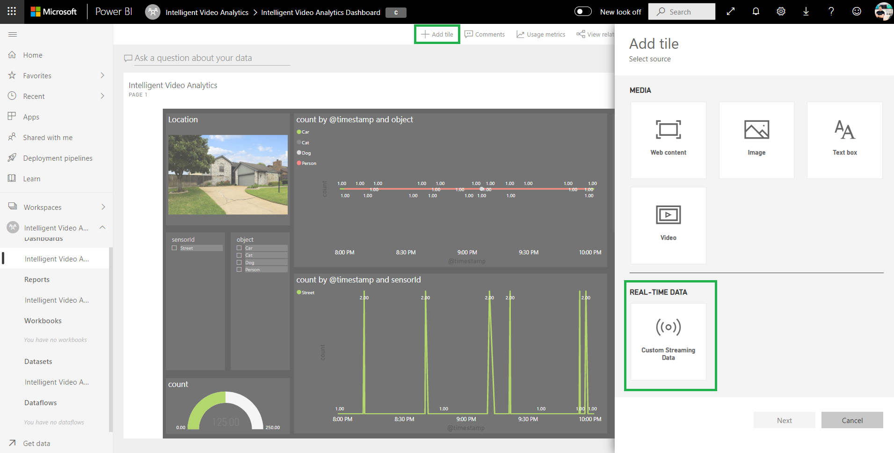

Select the "Intelligent Video Analytics Dataset", then "Next":

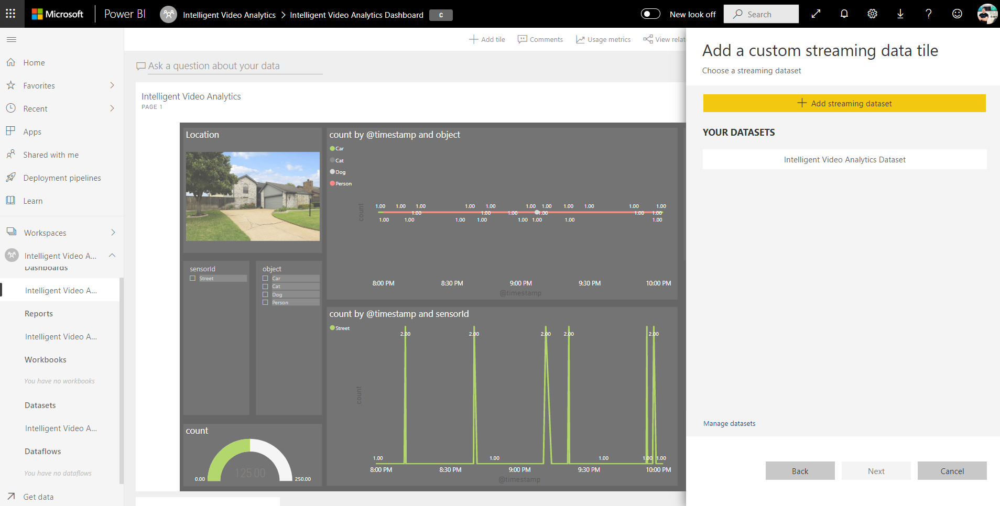

On the next screen, set "Visualization Type" to "Line chart", then configure the "Axis", "Legend", and "Values" as shown, then select "Apply":

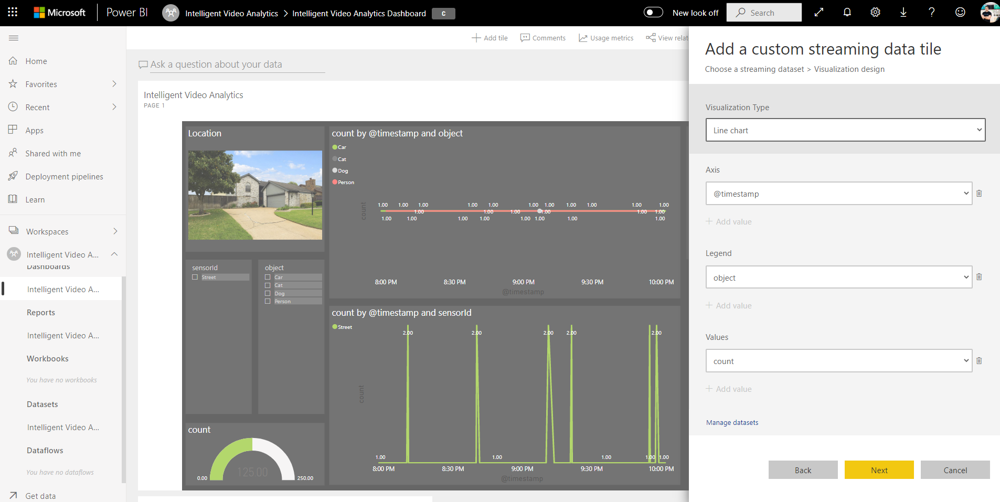

Your new visualization will now appear on the Dasbhoard and begin plotting detection telemetry in near real-time (approximately every 15 seconds if using the default Stream Analytics on Edge Job):
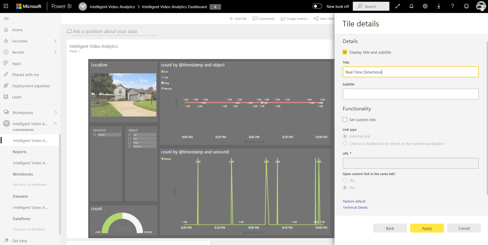

Repeat this process until you have a desirable result.

## Module 5.5 : Next Steps

Congratulations!  At this point, you have developed a full end-to-end Intelligent Video Analytics pipeline to report and visualize object detection data into PowerBI!  If you are curious about additional techniques to apply to your PowerBI dashboard, check out these resources:

* [PowerBI Documentation](https://docs.microsoft.com/en-us/power-bi/)
* [PowerBI Themes Gallery](https://community.powerbi.com/t5/Themes-Gallery/bd-p/ThemesGallery)